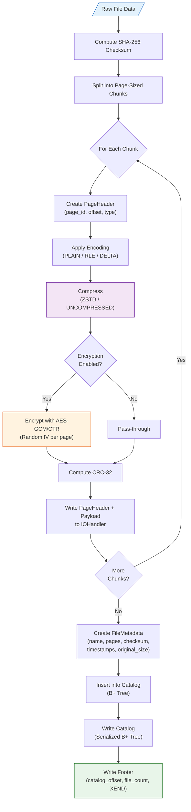
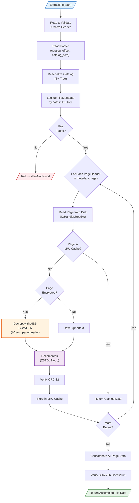
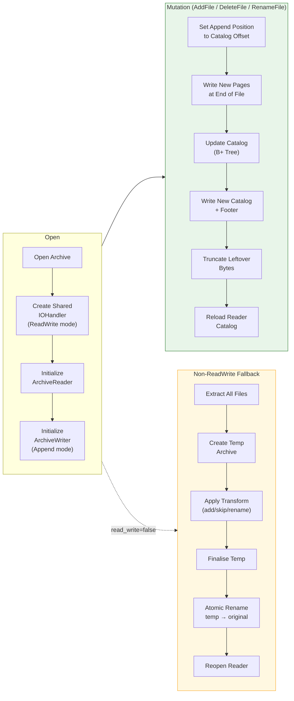
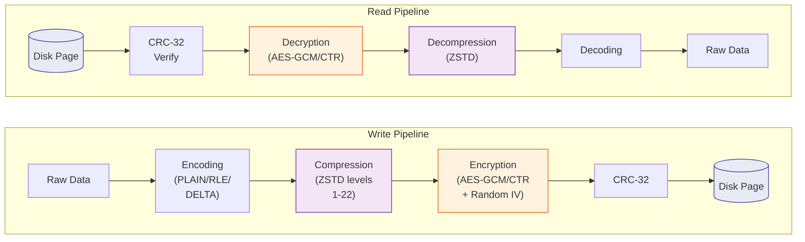

# XSTD — Express Standart Archive Format 

#### Status: ⚠️ Deprecated
**XSTD** (`.xstd`) is a high-performance binary archive format designed for secure, compressed file storage. It combines ZSTD compression, AES-GCM/CTR encryption, SHA-256 integrity verification, and a B+ Tree-based file catalog into a single, page-oriented container.

> [!Caution]
> This project was developed experimentally, it does not have a stable API, and it is for learning purposes only. Do not create pull requests or new issues as the project is deprecated. 
> **ALL RIGHTS OF USE ARE YOURS, NO LIABILITY IS ACCEPTED, YOU ARE RESPONSIBLE FOR ITS OPERATION.**

## Project Goals

- **High Performance**: Page-oriented I/O with memory-mapped reads and ZSTD compression (1-22 level range)
- ~**Strong Security**: AES-256-GCM authenticated encryption with per-page IVs; AES-CTR for streaming workloads~ (currently broken, do not use encryption)
- **Data Integrity**: SHA-256 per-file checksums and CRC-32 per-page verification
- **Efficient Catalog**: B+ Tree (order-64) file index with O(log n) lookup and prefix scan
- **In-Place Mutation**: ReadWrite mode enables add/delete/rename without full archive rewrite
- **Soft-Delete & Recovery**: Deleted files can be recovered when using soft-delete mode
- **Cross-Platform**: Windows (MSVC) and POSIX (Linux/macOS) support with platform-native I/O

> [!Warning]
> Currently, encryption not working due to a bug in the encryption layer. **DO NOT USE ENCRYPTION**
> The rest of the features not expected stable.

## Architecture Overview

```
┌──────────────────────────────────────────────────────────────┐
│                      Archive (High-Level API)                │
│          Open / Create / AddFile / ExtractFile / Close       │
└──────────────┬───────────────────────────┬───────────────────┘
               │                           │
        ┌──────▼───────┐           ┌───────▼───────┐
        │ ArchiveReader│           │ ArchiveWriter │
        │  - ListFiles │           │  - AddFile    │
        │  - Extract   │           │  - DeleteFile │
        │  - Stat      │           │  - Finalise   │
        │  - LRU Cache │           │  - Catalog    │
        └──────┬───────┘           └───────┬───────┘
               │                           │
               └─────────┬─────────────────┘
                         │
                   ┌─────▼─────────┐
                   │   IOHandler   │
                   │  ReadOnly     │ ←  Memory-mapped (zero-copy)
                   │  WriteOnly    │ ←  Sequential append
                   │  ReadWrite    │ ←  In-place r/w + mmap
                   └─────┬─────────┘
                         │
           ┌─────────────┼──────────────┐
           │             │              │
     ┌─────▼──────┐ ┌───▼────────┐ ┌───▼──────────┐
     │  Catalog   │ │ PageManager│ │  Disk File   │
     │ (B+ Tree)  │ │  (Bitmap)  │ │  [Header]    │
     │ str → Meta │ │ Alloc/Free │ │  [Pages...]  │
     └────────────┘ └────────────┘ │  [Catalog]   │
                                   │  [Footer]    │
                                   └──────────────┘
```

## Binary File Layout

> [!Important]
> The archive file struct maybe changed in the future as the format is still experimental.

```
 Offset 0                                                    EOF
 ┌──────────┬──────────┬──────────┬───────┬──────────┬──────────┐
 │ Archive  │  Page 0  │  Page 1  │  ...  │ Catalog  │ Archive  │
 │ Header   │ (32+data)│ (32+data)│       │ (B+Tree) │ Footer   │
 │ (32 B)   │          │          │       │          │ (32 B)   │
 └──────────┴──────────┴──────────┴───────┴──────────┴──────────┘
```

| Section        | Size    | Description |
|----------------|---------|-------------|
| Archive Header | 32 B    | Magic (`XSTD`), version, page size, encryption, flags |
| Pages          | Variable| Each page: 32 B header + compressed/encrypted payload |
| Catalog        | Variable| Serialized B+ Tree mapping file paths → metadata |
| Archive Footer | 32 B    | Catalog offset, catalog size, file count, magic (`XEND`) |

## How It Works

### Writing (Archive Creation / AddFile)

When a file is added to an XSTD archive, it goes through the following pipeline:



### Reading (ExtractFile)

When a file is extracted from an XSTD archive:



### ReadWrite Mode (In-Place Mutation)

When `read_write = true`, the archive supports efficient in-place operations:



### Compression & Encryption Pipeline



## Components

| Component | File | Description |
|-----------|------|-------------|
| **Archive** | `archive.h/cc` | Unified high-level API, coordinates Reader & Writer |
| **ArchiveReader** | `archive_reader.h/cc` | Read-only access, LRU page cache, extraction |
| **ArchiveWriter** | `archive_writer.h/cc` | Create/append, page writing, catalog serialization |
| **IOHandler** | `iohandler.h/cc` | Platform I/O: mmap reads, sequential/random writes, file locking |
| **Catalog** | `catalog.h/cc` | B+ Tree (order-64) mapping file paths to FileMetadata |
| **BTree** | `btree.h` | Generic B+ Tree with serialization, doubly-linked leaves |
| **PageManager** | `page_manager.h/cc` | Bitmap-based page ID allocator |
| **Compression** | `compression.h/cc` | ICompressor interface; ZSTD (1-22) and Noop implementations |
| **Encryption** | `encryption.h/cc` | IEncryptor interface; AES-GCM-256 and AES-CTR implementations |
| **SHA-256** | `sha256.h/cc` | OpenSSL EVP-based SHA-256 (streaming + one-shot) |
| **XXHasher** | `xxhasher.h` | XXH64/XXH32 non-cryptographic hashing |

## Building

### Prerequisites

- **CMake** 3.21+
- **C++20** compiler (MSVC 2022, GCC 12+, Clang 15+)
- **vcpkg** (dependency manager)
- **OpenSSL** (for encryption and SHA-256)
- **ZSTD** (for compression)
- **fmt** (formatting library)
- **CLI11** (CLI parsing, optional)
- **GTest** (unit tests, optional)

### Build Commands

```bash
# Configure (using vcpkg toolchain)
cmake --preset debug

# Build
cmake --build build/debug

# Run tests
ctest --test-dir build/debug/tests
```

### CMake Options

| Option | Default | Description |
|--------|---------|-------------|
| `XSTD_CLI` | `ON` | Build the CLI tool (`xli`) |
| `XSTD_TESTS` | `ON` | Build unit tests |

## CLI Usage

```bash
# Create a new archive
xli create myarchive.xstd

# Add files
xli add myarchive.xstd file1.txt file2.csv

# List files
xli list myarchive.xstd

# Extract files
xli extract myarchive.xstd -o output_dir/

# Show archive info
xli info myarchive.xstd

# Delete a file
xli delete myarchive.xstd file1.txt

# Recover a soft-deleted file
xli recover myarchive.xstd file1.txt -o recovered/
```

## Library Usage

```cpp
#include "archive.h"
using namespace xstd;

// Create a new archive
{
    ArchiveOptions opts;
    opts.codec = CompressionCodec{CompressionType::ZSTD, CompressionLevel::XSTD_greedy};
    Archive arch("data.xstd", opts);
    arch.Create();
    arch.AddFile("readme.txt", file_bytes);
    arch.AddFile("photo.png", std::filesystem::path("photo.png"));
    arch.Close();
}

// Open and read
{
    Archive arch("data.xstd");
    arch.Open();

    auto files = arch.ListFiles();
    auto info  = arch.Stat("readme.txt");

    std::vector<uint8_t> data;
    arch.ExtractFile("readme.txt", data);
    arch.Close();
}

// ReadWrite mode (in-place mutation)
{
    ArchiveOptions opts;
    opts.read_write = true;
    Archive arch("data.xstd", opts);
    arch.Open();
    arch.AddFile("new_file.txt", new_data);
    arch.DeleteFile("old_file.txt");
    arch.RenameFile("readme.txt", "docs/readme.txt");
    arch.Close();
}

// Encrypted archive
{
    ArchiveOptions opts;
    opts.encryption = ArchiveEncryption::Make(
        EncryptionAlgorithm::AES_GCM_V1, AesKeySize::AES_256);
    opts.key = my_32_byte_key;
    Archive arch("secure.xstd", opts);
    arch.Create();
    arch.AddFile("secret.dat", data);
    arch.Close();
}
```

## License

This project is licensed under the BSD License. See [LICENSE](LICENSE) for details.
